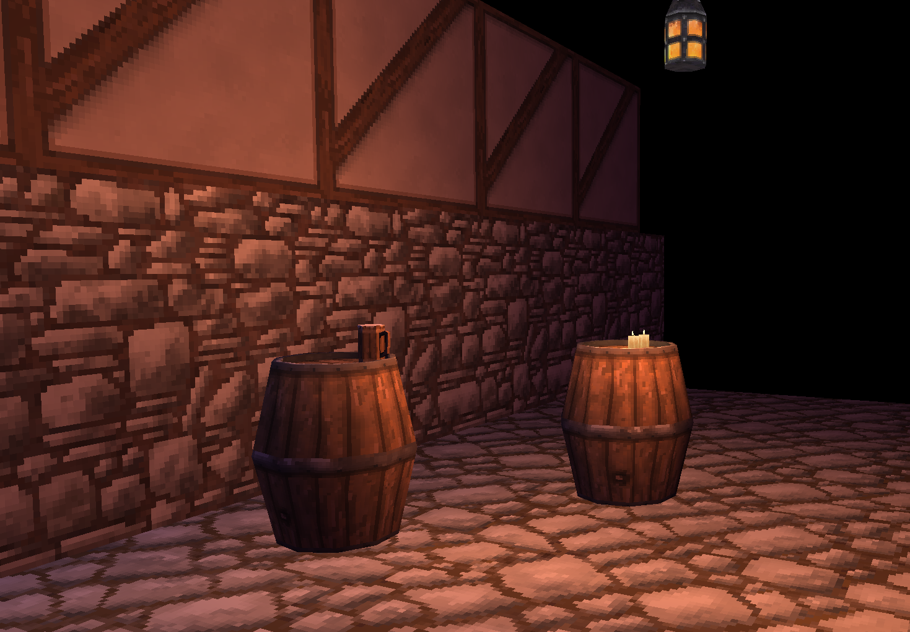
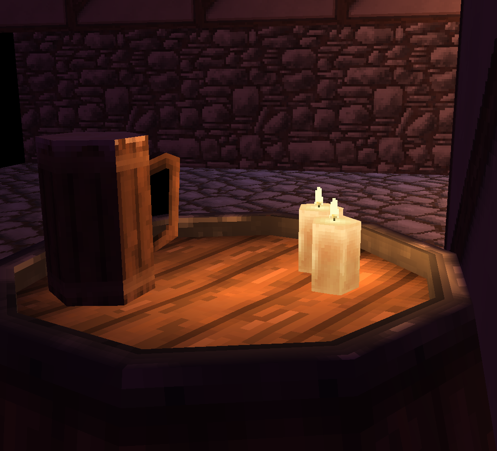

# Ebb (working title)
A little personal game project I use as a creative outlet.
It's supposed to become a minimalist fantasy game with a tiny world that feels big.
The game features 1990-2000 style assets with vertex lighting to give off that specific vibe.
This README page will be updated with more information as the project progresses.

## Tools
To make this project fun, I'm choosing to develop this game in a very suckless way with just Raylib and C.
To accomplish some of the game-enginy things I make my own tools, which are listed below:

- [Bricklayer](https://github.com/TatuLaras/bricklayer): A simple model viewer with hot-reloading capabilites to simplify texture editing with Aseprite. It's designed with my personal asset system in mind, where for each asset there is a single .obj and .aseprite file in the assets folder.
- [Noble](https://github.com/TatuLaras/noble): A scene editor designed for quickly building scenes in a grid-based fashion with a searchable dmenu-style list of all my assets. You can also edit the scene lighting and skybox. Features such as terrain editing are planned.

## WIP screenshots

